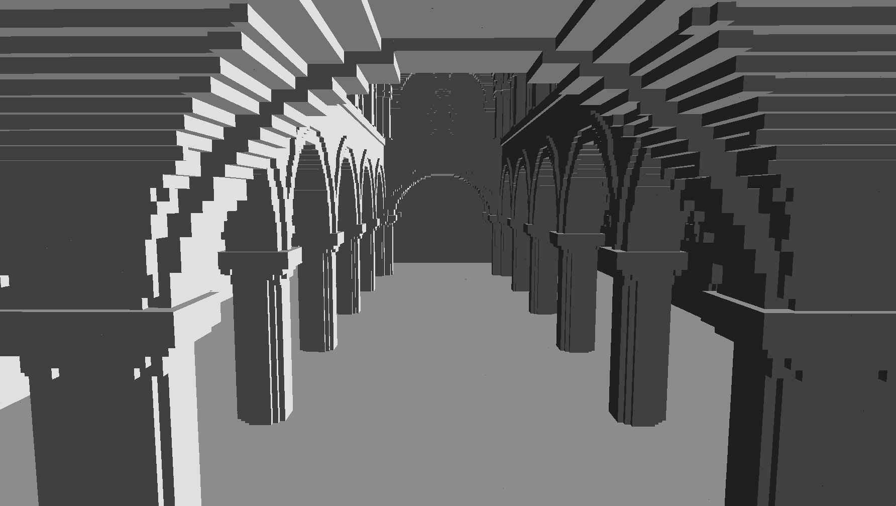
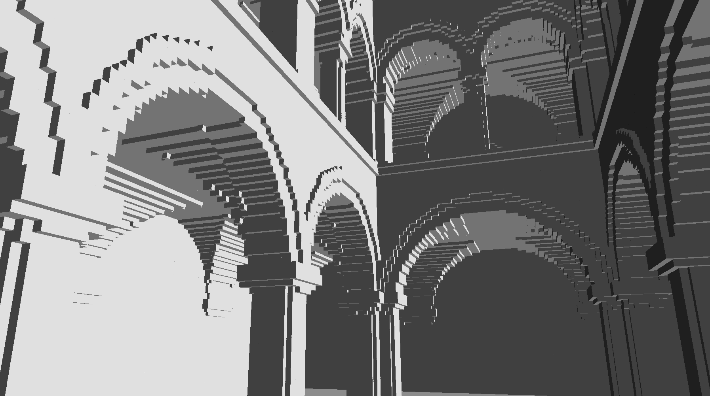

# Voxel Ray Engine

THIS IS VERY MUCH A WORK IN PROGRESS.

A Sparse Voxel DAG ray caster written in C++ with OpenGL.

### Dependencies:
* GLFW
* ASSIMP
* GLM
* [`GLAD`](https://glad.dav1d.de/#language=c&specification=gl&api=gl%3D4.6&api=gles1%3Dnone&api=gles2%3Dnone&api=glsc2%3Dnone&profile=core&loader=on) (OpenGL core v4.6)

### Build:
(Not tested)
`premake5 gmake && make`

