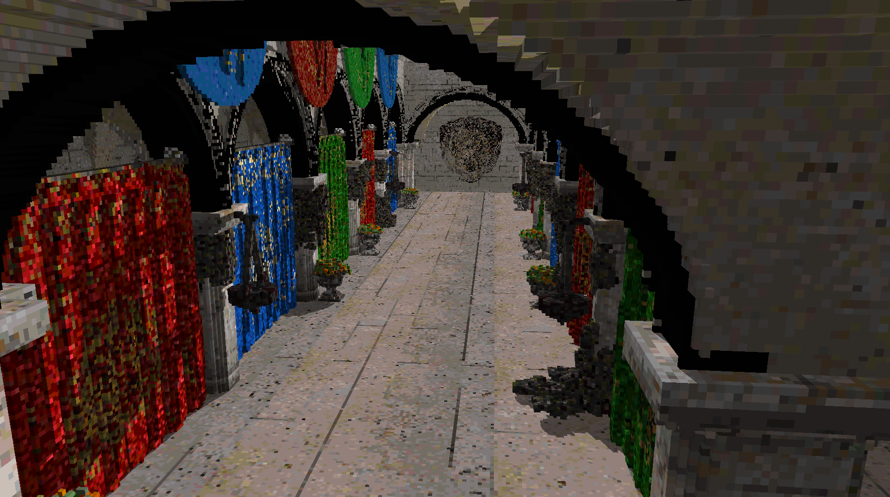
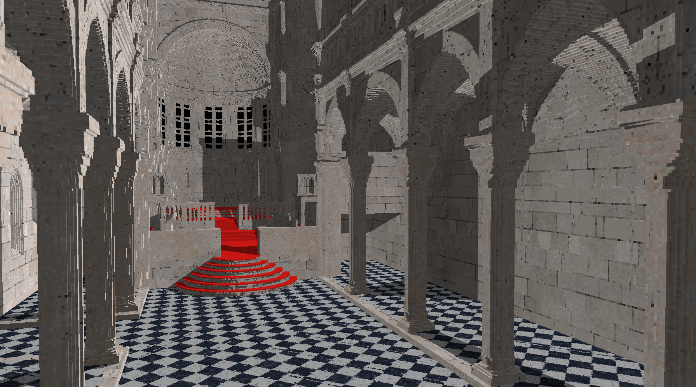
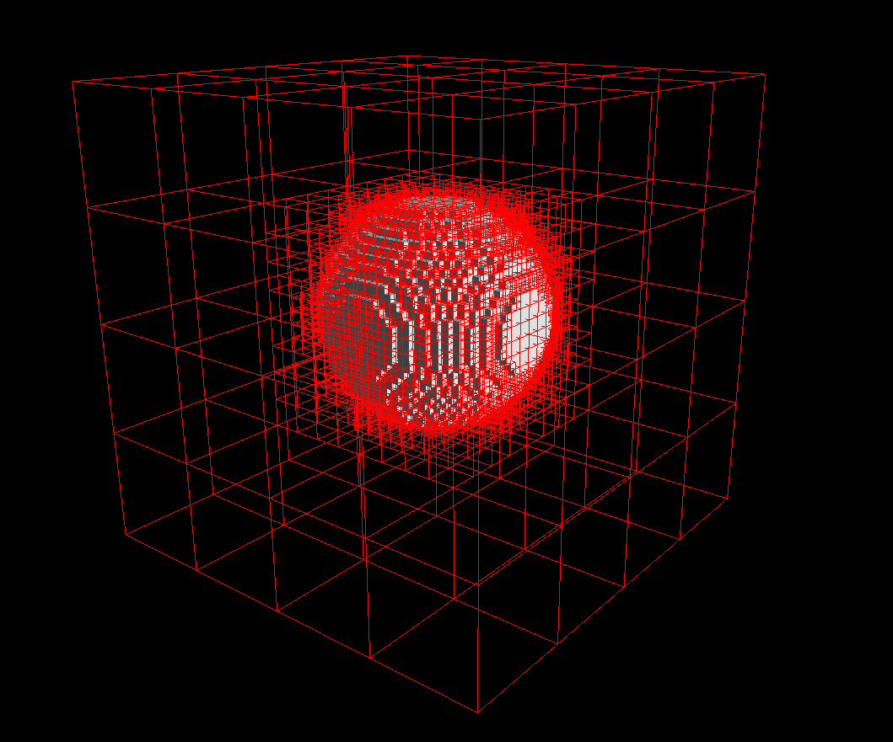

# Voxel Ray Engine

A Sparse Voxel DAG ray caster for [VMesh-CLI](https://github.com/Spatchler/VMesh-CLI) vm8 files written in C++ with OpenGL.

### Dependencies:
* GLFW
* GLM
* [GLAD](https://glad.dav1d.de/#language=c&specification=gl&api=gl%3D4.6&api=gles1%3Dnone&api=gles2%3Dnone&api=glsc2%3Dnone&profile=core&loader=on) (OpenGL core v4.6)

### Build:
`premake5 gmake && make`

