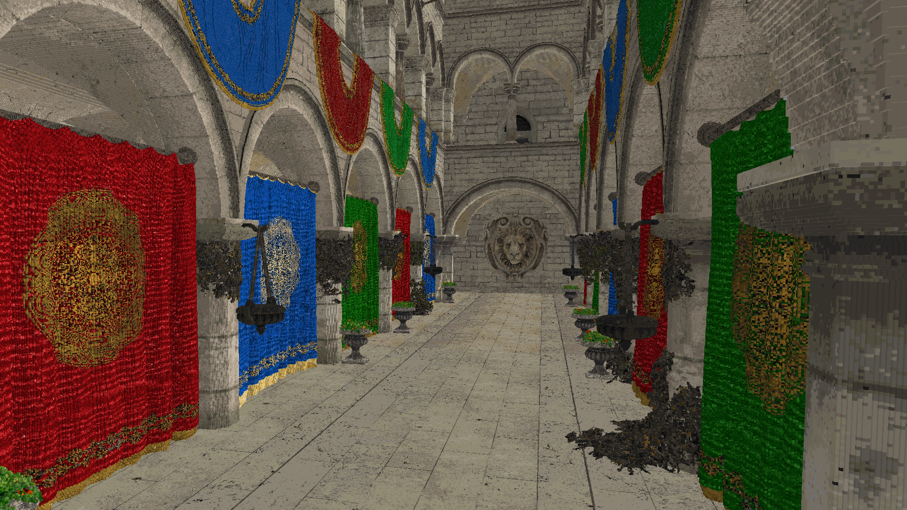
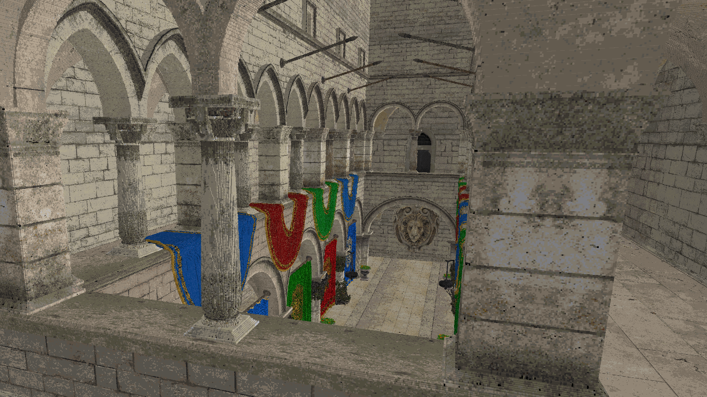
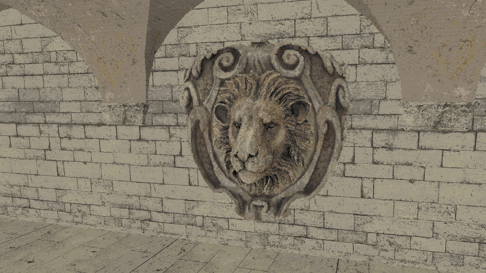
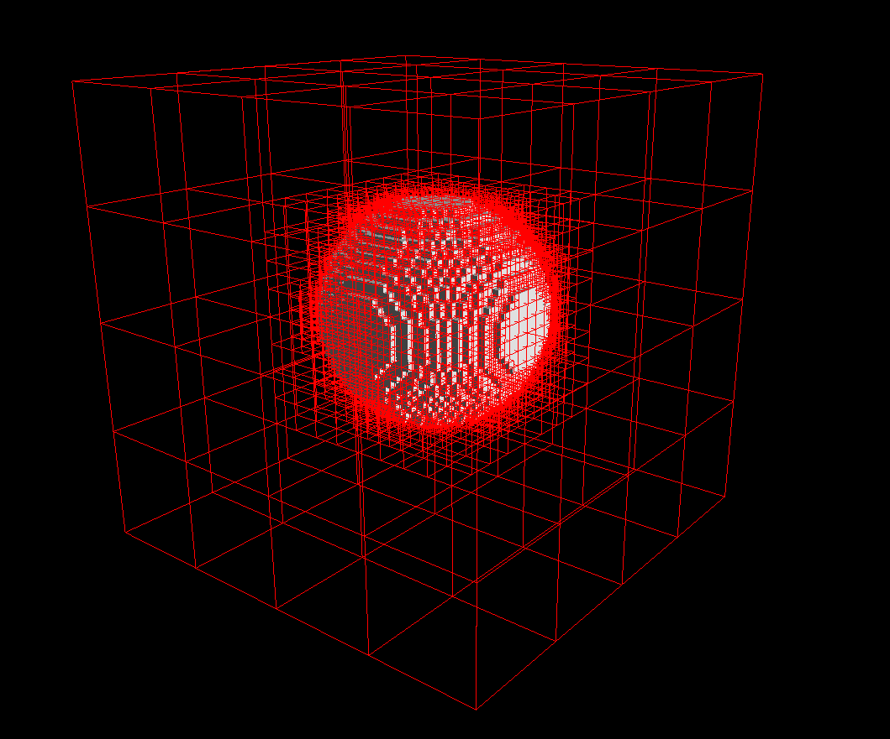
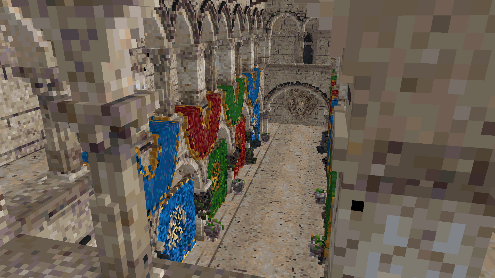
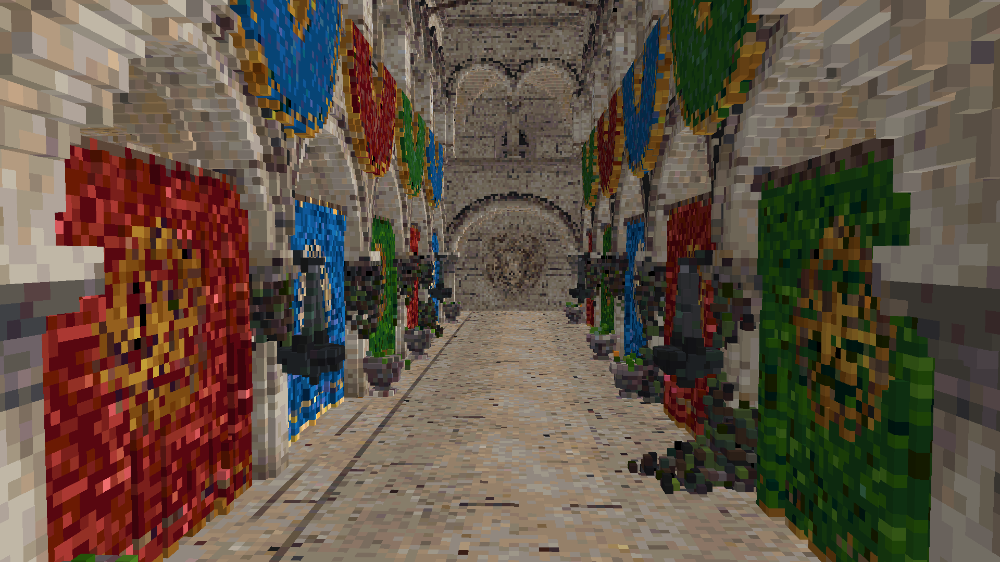
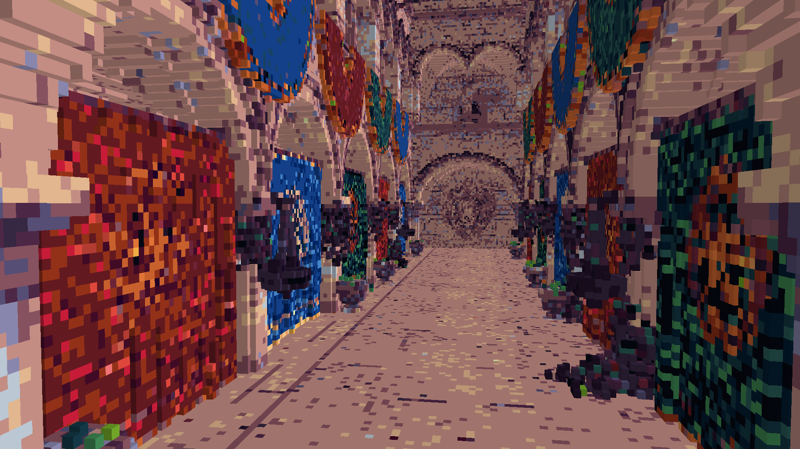

# Voxel Ray Engine

Crytek sponza voxelized with a generated palette at 4096 resolution

A Sparse Voxel DAG ray caster for [VMesh-CLI](https://github.com/Spatchler/VMesh-CLI) vm8 files written in C++ with OpenGL.

### Dependencies:

- glfw
- glm
- stb/stb_image.h
- [glad](https://glad.dav1d.de/#language=c&specification=gl&api=gl%3D4.6&api=gles1%3Dnone&api=gles2%3Dnone&api=glsc2%3Dnone&profile=core&loader=on) (OpenGL core v4.6)

Generate the glad files from the link and download and extract `glad.zip` in `dependencies/`

Install dependencies with your system package manager e.g. `# pacman -S glm glfw stb` and they should work straight away since the premake config includes from `/usr/include` and shared objects should be linked by the os

### Build:

`premake5 gmake && make`

### Some more screenshots:

Crytek sponza voxelized using the duel palette from lospec at 512 resolution

Crytek sponza voxelized using the journey palette from lospec at 512 resolution

